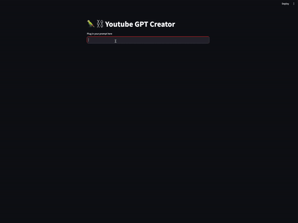

# AutoGPT YouTube Creator



The AutoGPT YouTube Creator is a cutting-edge application designed to automate the generation of YouTube video titles and scripts. Utilizing Streamlit for an intuitive web interface, LangChain for chaining language model operations, OpenAI's GPT for content creation, and Wikipedia for enriching content with reliable research, this app offers a seamless content creation experience for YouTube creators.

## Features

- **Automated Title and Script Generation**: Generate engaging titles and comprehensive scripts for YouTube videos based on user inputs.
- **Wikipedia Research Integration**: Enhance scripts with relevant and informative content from Wikipedia, ensuring scripts are not only creative but also informative.
- **LangChain Integration**: Leverages LangChain's capabilities for chaining language model operations, templating prompts, and managing conversational memory.
- **Memory Buffers**: Maintain history of generated titles and scripts, along with Wikipedia research, for easy access and reference.

## Prerequisites

Before you begin, ensure you have the following:
- An OpenAI API key

## Installation

1. **Clone the Repository**

```bash
git clone https://github.com/canberk17/autogpt_youtube.git
cd autogpt_youtube
```
2. **Setup Virtual Environment (Optional but recommended)**

```bash
python -m venv venv
source venv/bin/activate  # On Windows use `venv\Scripts\activate`
```
3. **Install Dependencies**

```bash
pip install -r requirements.txt
```
4. **Environment Variables**
Create a .env file in the root directory of the project and add your OpenAI API key:

```bash
OPENAI_API_KEY=your_openai_api_key_here
```
5. **Running the Application**
To run the application, execute:

```bash
streamlit run app.py
```